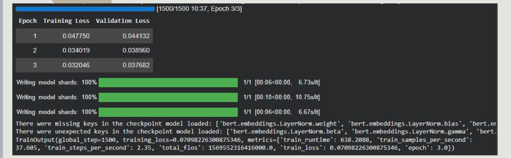
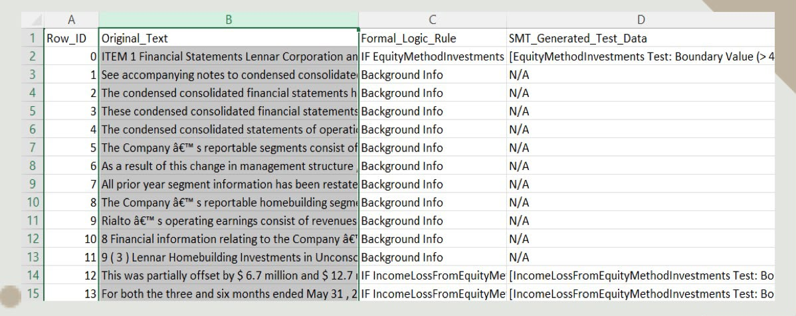

# llm4fin-automated-testcase-generation
An NLP-powered framework for automated software test case generation from SEC filings using FinBERT, Named Entity Recognition, and Large Language Models.

# LLM4Fin: Automated Test Case Generation for FinTech Software

## Overview
...

## Features
- Financial Named Entity Recognition
- FinBERT-based text understanding
- Automated business rule extraction
- LLM-powered software test case generation

  ## Features
- Extracts financial rules from SEC filings
- Uses FinBERT for financial NLP
- Named Entity Recognition (NER)
- Automatically generates software test cases
- Exports structured CSV output

## Tech Stack
- Python
- FinBERT
- Transformers
- PyTorch
- Pandas
- Scikit-learn
- Jupyter Notebook

## Dataset
- SEC Financial Filings
- Custom processed dataset (10k records)

## Results
The model successfully extracted financial logic rules from SEC filings and generated structured software test cases automatically.

## Project Structure

## Technologies
- Python
- FinBERT
- Hugging Face Transformers
- PyTorch
- Pandas

## Dataset

The project uses financial filing data stored in `LLM4Fin_Final_Midsem_10k.csv`.

## How to Run

1. Open `DL_sample.ipynb`
2. Install dependencies
3. Run the notebook cells in sequence

## Results

- Automated extraction of financial entities
- Structured software test case generation
- Reduced manual effort in test design

  ## Demo

### Generated Test Cases

### Training

